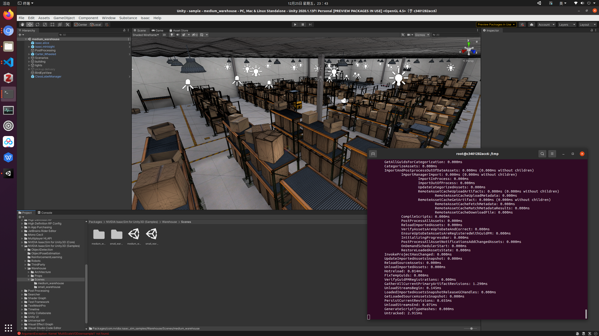

# Unity Hub in Docker container

This repo is a part of my NVIDIA Isaac Sim Project, and this (experimental) Dockerfile is intended to run UnityEditor with nvidia-docker， since I encountered some issues under Ubuntu 20.04.

## Prerequisites

- Linux OS

- NVIDIA GPU

- nvidia-docker

- (Optional) Downloaded UnityEditor

- (Optional) Unity projects

## HOW-TO

    git clone https://github.com/DmitriZhao/unity-hub-docker
    docker build . -t unity-hub
    xhost +
    docker run -it \
        --name unity-hub \
        --runtime=nvidia \
        --cap-add SYS_ADMIN \
        --device /dev/fuse:rw \
        --security-opt apparmor:unconfined \
        --privileged \
        --env "DISPLAY=$DISPLAY" \
        -v /tmp/.X11-unix:/tmp/.X11-unix \
        -v /home/username/ws:/home/username/ws \
        -v /opt/unity:/opt/unity unity-hub

Where /home/username/ws is the location of your project(s), and /opt/unity is the location of your unity editor(s).

If everything goes well, now you can login, activate license, import projects and run UnityEditor with GPU.

## References

[1] The main structure: [https://forum.unity.com/threads/headless-mode-isnt-really-headless.761552/](https://forum.unity.com/threads/headless-mode-isnt-really-headless.761552/)

[2] The "dd if" command: [https://github.com/AppImage/AppImageKit/issues/828](https://github.com/AppImage/AppImageKit/issues/828)
